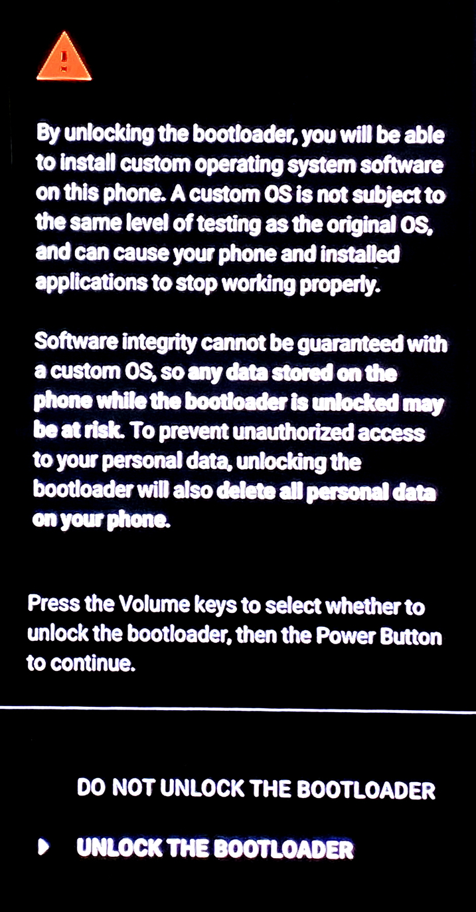
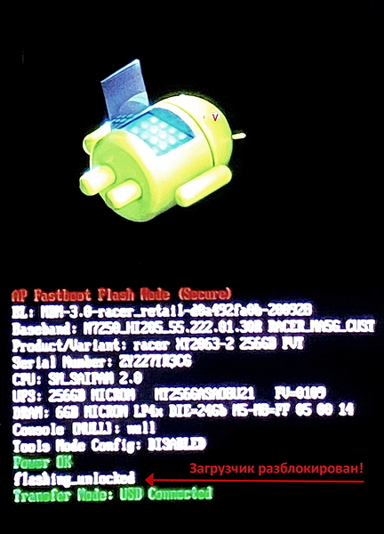
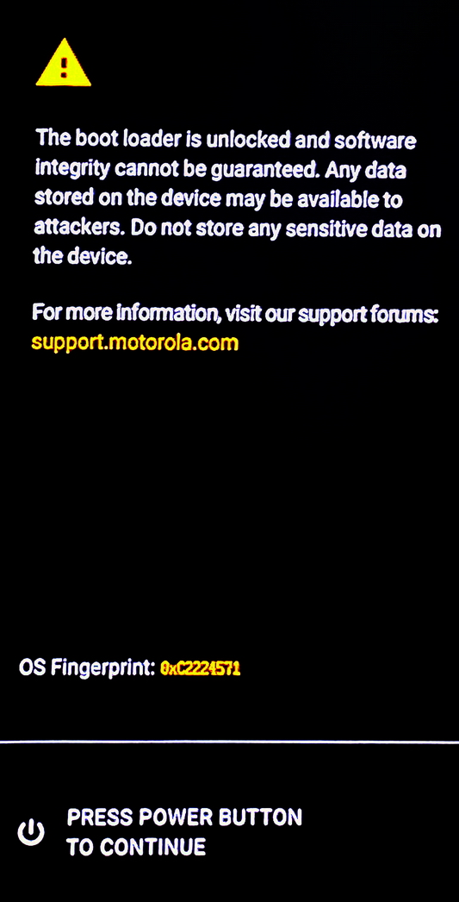
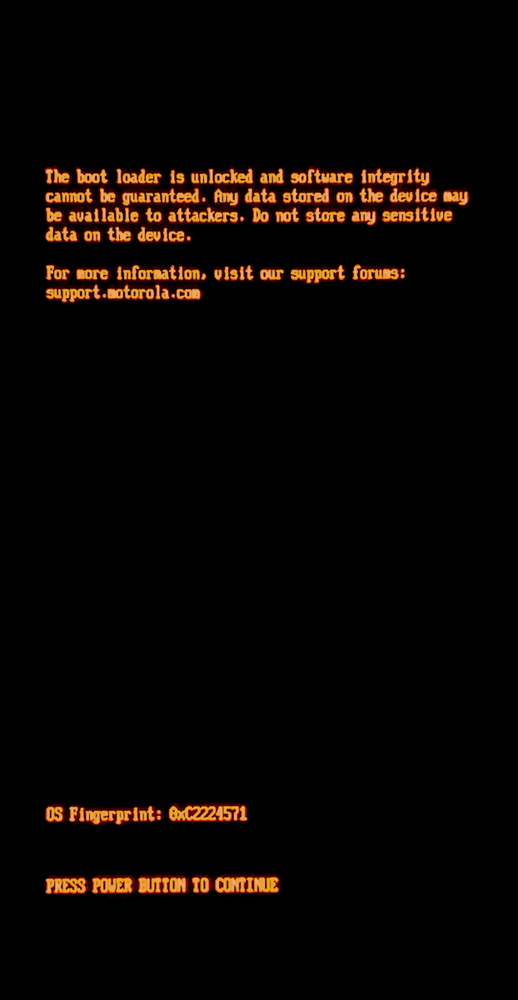

# Разблокировка загрузчика

https://en-us.support.motorola.com/app/standalone/bootloader/unlock-your-device-b

https://4pda.to/forum/index.php?showtopic=1015547&st=780#entry107838436

> @Lex-DRL :
> 
> Протестировано мной на Windows 10 x64 - 14.03.2026
> 
> Да, я в 2026 специально поставил "устаревшую" Win10, и для надёжности все действия с телефоном совершал только из-под неё.

> [!WARNING]
> На начало 2026 у бренда Motorola рейтинг по разблокировке загрузчика - "чуть лучше, чем тотальный ужас" (`⛔ Avoid at all costs!`). Ретинг полностью заслуженный, т.к. разблокировка - строго онлайн и **НАМЕРТВО** привязана к сайту моторолы. Так что когда этот онлайн-сервис будет отключен - лишь вопрос времени.
> 
> https://github.com/zenfyrdev/bootloader-unlock-wall-of-shame
> 
> Если вы намерены разблокировать свой телефон, даже если "когда-нибудь потом" - лучше сделать это ASAP.

## ❗ Предварительные требования

1. На компьютере 🖥️ - должны быть установлены [ADB и USB драйверы](/Drivers).
	- Platform-tools (содержит `adb` и `fastboot`) из архива - извлечь в корень любого диска (`C:\`, `D:\`, и т. д.)
	- После установки драйверов - лучше перезагрузиться.
2. На телефоне 📲 :
> [!IMPORTANT]
> Должны быть включены:
> - Режим разработчика, в котором:
> - Заводская разблокировка (OEM Unlock)
> - Отладка USB (USB Debug)
3. Также рекомендую до основных процедур хоть что-то попробовать сделать через ADB и сохранить ваш компьютер на телефоне как доверенное устройство:
	- Открыть командную строку в папке `platform-tools` (как - см. ниже)
	- В командной строке:
		```
		adb devices
		```
	- Если в Windows всплывёт окно файерволла - всё разрешить.
	- Если на этом телефоне с этого компа по ADB подцепляетесь впервые - там тоже должно всплыть окно подтверждения. Ставим галочку про сохранение девайса и соглашаемся.

## 🔓 Непосредственно разблокировка

> [!CAUTION]
> В процессе разблокировки **ВСЕ ДАННЫЕ** с телефона будут стёрты! Будет полный fatory reset.

1. Загружаемся в режим fastboot:
	- Выключаем телефон.
	- Зажимаем комбинацию клавиш `Громкость -` и `Включение`.
2. В папке `platform-tools`, которую ранее распаковали в корень диска, открываем командную строку:
	- Зажимаем на клавиатуре клавишу Shift, и вместе с ней - щёлкаем правой кнопкой мыши на пустом месте в папке.
	- В выпавшем окне выбираем пункт `Открыть окно команд` или `Открыть окно PowerShell здесь`.
	- Либо - просто тыкаем в строке адреса, вбиваем там `cmd` -> Enter.
3. В командной строке выполняем проверку подключения телефона:
	```
	fastboot devices
	```
4. Если телефон определяется - вводим команду:
	```
	fastboot oem get_unlock_data
	```
5. В окне командной строки вы должны увидеть примерно следующее:
	```
	(bootloader) 0A40040192024205#4C4D3556313230
	(bootloader) 30373731363031303332323239#BD00
	(bootloader) 8A672BA4746C2CE02328A2AC0C39F95
	(bootloader) 1A3E5#1F53280002000000000000000
	(bootloader) 0000000
	```
6. Выделяем текст, копируем его, вставляем в текстовый редактор (блокнот) и удаляем всё лишнее, чтобы остался только сам уникальный буквенно-цифровой код вашего девайса - в одну строку, без пробелов. Должно получиться как-то так:
	```
	0A40040192024205#4C4D355631323030373731363031303332323239#BD008A672BA4746C2CE02328A2AC0C39F951A3E5#1F532800020000000000000000000000
	```
7. Переходим на страницу разблокировки загрузчика официального сайта MOTO:
	- https://motorola-global-portal.custhelp.com/app/standalone/bootloader/unlock-your-device-b
	- Здесь нужно зарегистрироваться, и в пустое поле 6-го пункта вставить получившуюся строку.
8. Нажать на `Can my device be unlocked?`. Не должно появиться никаких ошибок при данной проверке. Ставим галку напротив надписи `I Agree` - и нажать `REQUEST UNLOCK KEY`.
9. Если все действия выполнены верно, на почту должно прийти письмо с кодом разблокировки. Его нужно скопировать и вернуться к командной строке.
10. Далее, ввести команду `fastboot oem unlock КОД_РАЗБЛОКИРОВКИ`, где "КОД_РАЗБЛОКИРОВКИ" - это код, который пришел на почту. После ввода команды на экране телефона должно появиться меню выбора опций разблокировки:



Делаем выбор кнопками громкости. "Не разблокировать" - верхняя строка, "Разблокировать" - нижняя. Подтверждаем выбор нажатием кнопки Включения.
Если вы выбрали "Разблокировать", то вы увидите на экране режима загрузчика следующее:



Загрузчик разблокирован!

**После разблокировки загрузчика - при включении телефона будет загружаться экран с предупреждением о разблокированном загрузчике.**



## Модифицированное `logo.bin`

Практически на всех моделях телефонов Motorola до 2019 г. выпуска предупреждение о разблокированном загрузчике убиралось установкой модифицированного `logo.bin`. Конкретно на этой модели при применении этого способа стандартное уведомление вызывает появление на экране другого сообщения как на фото. Мне не известен способ его убрать. Читал, что эта штука где-то глубоко закопана в bootloader.



> [!NOTE]
> @Lex-DRL :
> 
> Остальная часть оригинального поста совершенно осознанно не включена сюда, т.к. мной не проверялась и в целом не рекомендуется.
