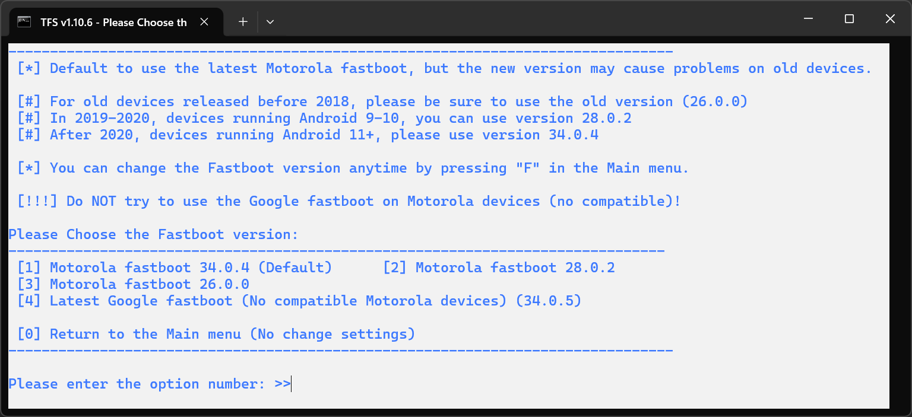
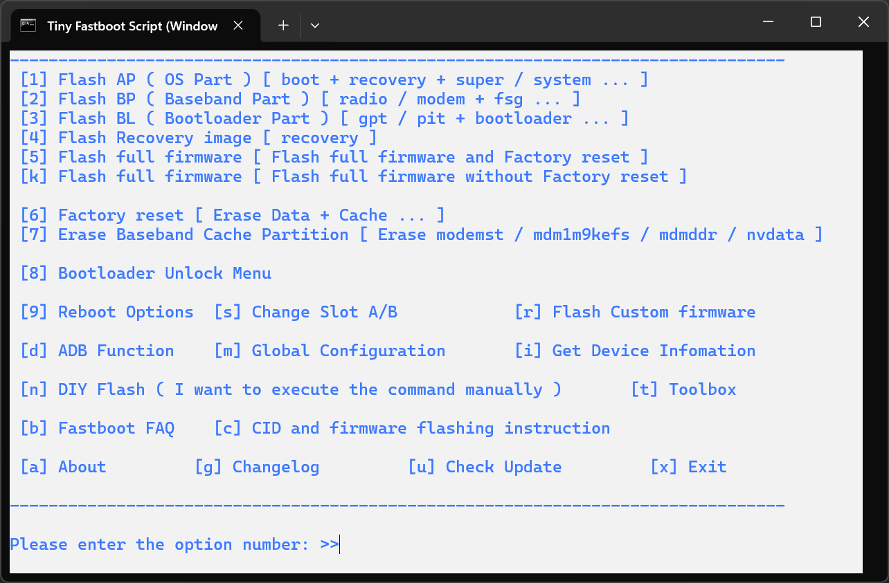

https://4pda.to/forum/index.php?act=findpost&pid=133216870&anchor=Spoil-133216870-1

# Установка stock ROM

> @Lex-DRL :
> 
> Протестировано мной на Windows 10 x64 со скриптом `v1.10.6` + дополнен гайд - 15.03.2026
> 
> Да, я в 2026 специально поставил "устаревшую" Win10, и для надёжности все действия с телефоном совершал только из-под неё.

## Подготовка

1. Устанавливаем [драйверы](/Drivers) (`platform-tools` - не надо) и перезагружаемся.
2. Качаем и распаковываем универсальный флэшер с поддержкой Moto - `Tiny-Fastboot-Script`:
	- [Версия `1.10.6` - последняя доступная на момент оформления этого репо](Tiny-Fastboot-Script_v1.10.6_en-US_by_AlphaEva.zip)
	- [Версия `1.10.0` - предложенная в посте на 4PDA](Tiny-Fastboot-Script_v1.10.0_en-US_by_AlphaEva_4.zip)
		- [Она же, но ссылкой на google-drive из оригинального поста на 4PDA](https://drive.google.com/file/d/1gV6ky-uxuA_oqwIStoty9lx9PSdtvLWw/view?usp=sharing)
	- ["Официальная" страница скрипта, где он обновляется (всё на китайском)](https://bbs.ixmoe.com/t/topic/17646)
3. Качаем ROM:
	- [China](https://mirrors-obs-1.lolinet.com/firmware/lenomola/2021/nio_retcn/official/RETCN/)
		- [Последний на Android 11 - `RRN31.Q3-1-27-1`](https://mirrors-obs-1.lolinet.com/firmware/lenomola/2021/nio_retcn/official/RETCN/XT2125-4_NIO_RETCN_11_RRN31.Q3-1-27-1_subsidy-DEFAULT_regulatory-DEFAULT_CFC.xml.zip)
		- [Последний на Android 12 - `S1RN32.55-16-13`](https://mirrors-obs-1.lolinet.com/firmware/lenomola/2021/nio_retcn/official/RETCN/XT2125-4_NIO_RETCN_12_S1RN32.55-16-13_subsidy-DEFAULT_regulatory-DEFAULT_CFC.xml.zip)
	- [Global](https://mirrors-obs-1.lolinet.com/firmware/lenomola/2021/nio/official/)

## Какой именно CID качать для глобалки

**TL;DR**: `RETAIL`. [А тут - объяснение, почему](Which-CID.md)

## ❗ Непосредственно перепрошивка

1. Создаём пустую папку с коротким названием в корне диска, но это **НЕ** должен быть диск `C:\` _(так написано в инструкциях самого скрипта)_. Подойдёт что-то вроде: `D:\QQQ`
2. Переносим/распаковываем в эту папку все файлы:
	- как содержимое архива `Tiny-Fastboot-Script`,
	- так и туда же - содержимое архива ROM.
	- Должно получиться, что скрипт `flash.bat` и его папка `tools` лежат в одной куче с файлами прошивки (всякие там `boot.img`, `bootloader.img`, `BTFM.bin`, ..., `vendor_boot.img`).
3. Подключаем телефон и перезагружаем в bootloader _(зажав кнопку громкости вниз при перезагрузке телефона)_.
4. Запускаем `flash.bat`:
	- При первом запуске он должен спросить, какой именно fastboot использовать:
		
		
	- Под наш телефон - нужен `Motorola fastboot 34.0.4` (вариант `1`).
	- Если не спросил, и нас сразу выкинуло в главное меню - то в нём `f` -> Enter - и там выбираем-таки этот, просто чтобы удостовериться.
	- По итогу оказываемся в главном меню:
		
		
5. Через скрипт чистим раздел Data:
	- Клавиша `6` -> Enter.
6. Запускаем сам процесс прошивки:
	- либо `5` для полной перепрошивки...
	- ... либо остальные пункты под вашу задачу.
	- Посреди перепрошивки телефон перезагрузится и переподключится к компу - это нормально.
7. Дожидаемся конца перепрошивки и ребутаем телефон через пункт `9` Reboot options, либо жмём в bootloader Start клавишей питания.

> ### Касательно Linux
> 
> Скрипты `flash_all_Edge_S.bat` и `flash_without_data_Edge_S.bat` вполне запускаемы в консоли, но пишут ошибки пути. Возможно, подредактировав батник, можно адаптировать.
> Драйвера не требуются, только сделать батники исполняемыми.
> `Tiny Fastboot Script` запускается через Wine, но не видит девайс, возможно потому что цепляется не к тому ADB. Последняя версия ADB, как известно, не подходит для Moto.
> 
> upd: я только потом глянул начинку `flash_all_Edge_S.bat` - а там просто набор из fastboot команд. Так что можно либо их копировать и по одной, либо в консоли указать папку и только потом запускать скрипт.
> Но возможно ещё ошибки были из-за того, что способ для А11 и там что-то менялось.

## Бэкап приложений вместе с данными

> [!WARNING]
> Способ требует Root

1. Ставим из GP или F-Droid приложение NeoBackup.
2. Заходим и ищем в поиске нужное приложение, ставим нужные галочки, бэкапим.
3. Перед перепрошивкой не забываем перенести папку Neo Backup на ПК или флэшку.

> Пример приложений для бэкапа:
> - банковские приложения
> - WA
> - Номерограм (ибо нету аккаунта)
> - приложения для часов (ибо некоторые требуют сброс часов до заводских)
> - браузеры (к примеру Firefox/Fennec)
> - аутенфикаторы
> - AccuBattery (сохранить телеметрию акб)
> - Tower Collector
> - ... и другие приложения без аккаунта + селф хостед приложения.

## Настройка china stock ROM

1. При первой загрузке выбираем ENG и любой регион (влияет лишь на канал обновлений, что уже неактуально)
2. Скипаем предложение установки рекомендуемых приложений
3. После входа в систему удаляем рекомендуемые приложения, которые уже были в ROM
4. Также можно удалить LeSync, LeVoice и другие Le приложения, ибо язык не меняется в будущем
5. Перед тем как сортировать приложения в папке решите какой режим Moto Launcher оставите. Ибо переключение с Open на App tray не сохраняет папки
6. Ставим новое приложение клавиатуры, ибо даже при переключении на ENG сток китай будет мешать, например при вводе паролей в приложениях.
Как вариант к примеру HeliBoard. Там можно настроить нужные локали и конфиги и сделать бэкап. После чего перенести на china ROM и активировать бэкап.
7. Для установки приложений без гугл сервисов можем установить F-Droid (из приятныхз клиентов Droid-ify) и затем из него Aurora Store для GP приложений. Для гитхаб приложений - Obtanium. К примеру сейчас актуально для установки Iceraven, ибо Fennec перестал обновляться.
8. Включаем все GNSS и двухчастотку. Актуально для районов с РЭБ
	- активируем режим разработчика
	- заходим в Settings > System > Developer options > Force full GNSS measurements
	- активируем опцию
9. Для передачи приложениям русской локали и частичного перевода настроек + интерфейса, ставим из F-Droid приложение MultiLocale
	- Кто бэкапил приложения через NeoBackup, теперь можно переносить
	- Теперь можно настраивать шторку. В стоке там есть лишнее, а внизу зато есть нужные, к примеру Эквалайзер
	- В настройках проверяем русскую локаль, если стоит второй то перемещаем на первую строку
	- Отключаем обновление системы. Чтобы не висело на счётчике или в фоне
	- В настройках симок можно активировать VoWiFi (в stock ROM не нужен Magisk модуль)
	- В разделах Display и System > Gestures есть полезные настрййки жестов и пр. повседневщины
	- В System > Производительность я бы отключил Ускорение ОЗУ (тут могут быть споры. решение сугубо ваше)
	- В Device Shield настраиваем автозаупск приложений, фоновую работу и пр. на ваше усмотрение
	- Для правильной работы фоновых приложений надо в Device Shield настраивать Background running + настройках самого приложения Battery > Unrestricted
	- Запускаем Aurora Store и обновляем системные приложения. Например движок хрома, системные андроид приложения, приложения связанные с оболочкой.
	А вот камеру на свою усмотрение, смотря хуже/лучше ведёт последняя версия. Аналогично решаем ли обновлять Ready For до Smart Connect. Если не хотим в будущем порчи приложений, то - зажимаем нужное приложение и выбираем Добавить в чёрный список
	- Чтобы приложения не ругались на Google серисы, - System > Google Play Services
	Актауально и перед установкой гугл сервисов.
	- Для переназначения левой физической клавиши System > Gestures > One-key tap
	доступно как выбор приложения, так и выбор конкретного чата в мессенджерах
